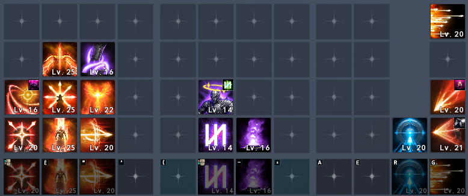
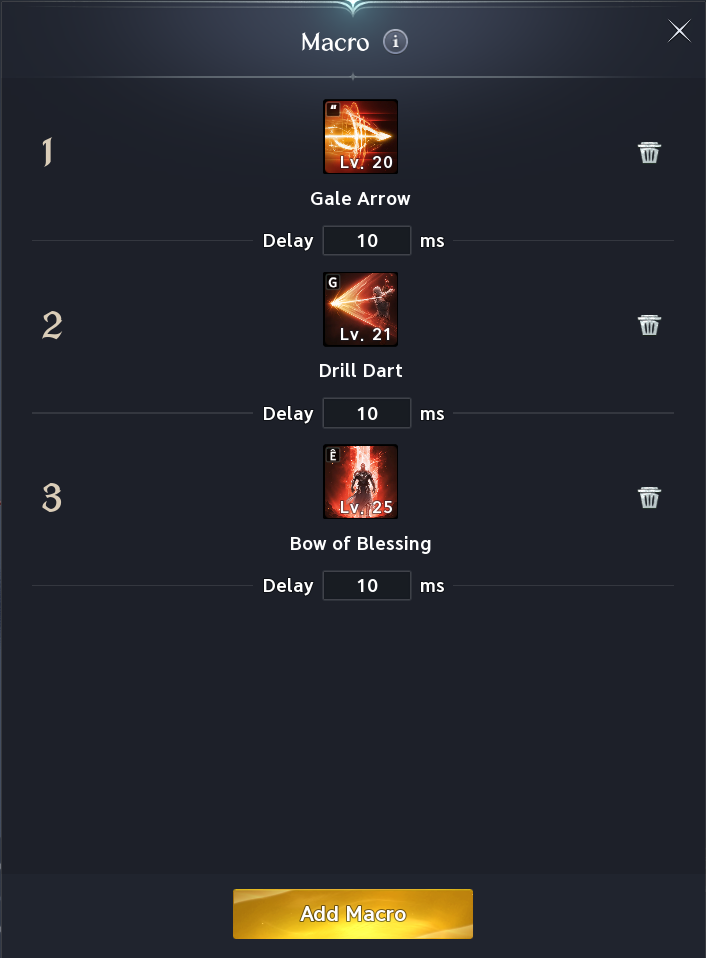
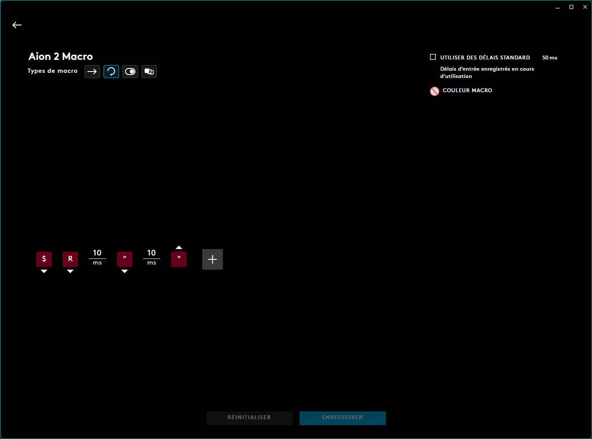

# Macro

!!! info
    Voici la dernière version de la macro que j'utilise à Taïwan et que je compte utiliser sur Global. Elle comprend **4 Stigmas** afin de mieux correspondre aux limites prévues sur Global.

    Elle combine la macro configurable en jeu et une macro externe créée dans le logiciel de votre souris Logitech.

!!! warning "Macro non définitive"
    Cette macro pourra encore évoluer au fil de mon expérience sur Global, où le ping devrait être beaucoup plus raisonnable.

## Disposition des sorts

## Configuration de la macro
*Macro en jeu*  

*Macro Logitech*

!!! info "Info comp."
    Dans la macro externe Logitech, la touche **$** correspond à celle que j'ai assignée en jeu à la macro intégrée. Elle est configurée comme un appui maintenu.

    La touche **R** correspond à celle du sort principal (ici **Snipe** pour le Ranger) et est également configurée comme un appui maintenu.

    La touche **"** correspond à celle associée à la colonne contenant **Gale Arrow** et les autres sorts. Elle est configurée pour se répéter en continu. Vous remarquerez qu'elle est déjà utilisée dans la macro en jeu. Après plusieurs essais, j'ai constaté que ce doublon fonctionne mieux : il garantit le lancement des sorts de cette colonne dès qu'ils sont disponibles.
