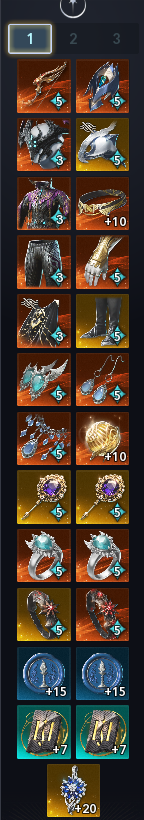

# Guide du Ranger — Sommaire

*Le guide d'un étranger qui ne fait pas de DPS sur la version **TW**.*

!!! warning "Guide orienté PvE"
    Ce guide est orienté **PvE**. Chacun peut bien sûr l'adapter à ses préférences.

!!! info "Terminologie"
    Ce guide reprend les noms et termes **anglais** du jeu. Pas de panique pour les compétences : les icônes vous aideront à reconnaître les sorts.

## Guide

- [Leveling 1-45](leveling/index.md)
- [Daevanion](leveling/daevanion.md)
- [Skills & Spécialités](skills/index.md)
- [Builds PvE](builds/index.md)
- [Macro](gameplay/macro.md)

---

## À propos & Crédits

Ce guide est créé et maintenu par **Natsuro**/**Selenia**.

Il est principalement orienté **PvE Ranger** et destiné à la version
**Global d'Aion 2**.

Après plus de **2 000** heures de jeu à Taïwan, mon Ranger a atteint **6 354 Gear Score** et **931K Combat Power**.

Les recommandations présentes dans ce guide sont basées sur mon expérience
personnelle, mes tests en jeu ainsi que différentes ressources de la
communauté Aion 2.

??? note "Équipement actuel de mon ranger"
    Petite capture souvenir de l'équipement et du build de mon Ranger, grâce au site [Shugo.gg](https://shugo.gg/character?id=DQkBJERS6s1OFPywzmRBuX5XOhPDyxILL65ABn6N2EA%3D&server=2016&region=TW&name=SeIenia){ target="_blank" } !  
    

### Contribuer

Vous avez repéré une erreur ou une information obsolète, ou vous avez une suggestion ?

Vous pouvez ouvrir une issue ou proposer une modification directement
sur le dépôt GitHub du guide.

!!! info
    **Aion 2** et les éléments du jeu présentés dans ce guide appartiennent
    à **NCSOFT**.

    Ce guide est un projet communautaire non officiel et n'est pas affilié
    à NCSOFT.
