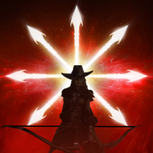
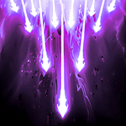

# Leveling

## Intro

This section covers the **leveling process from 1 to 45** as a whole. I won't break it down into individual level brackets.

The leveling plan is simple: complete the **main quests (yellow)**, then take the **side quests (green)** you come across along the way.

Some green quests are just as important as the main quests because they reward you with:

- Daevanion points;
- PvE runes;
- gear, especially early-game accessories that are only available from these quests.

Keep in mind that completing side quests can unlock more side quests, which may reward you with stronger accessories.

Try to collect as many **feathers** as you can along the way. However, don't stray too far from your route while completing main and side quests.

Remember to complete your **Sealed Dungeons** and **Strongholds** as well.

!!! note
    Once your Monolith reaches **level 30**, don't spend too much time collecting the remaining feathers. They are no longer essential.

??? tip "Speeding up leveling"
    If you want to optimize or slightly speed up leveling, I recommend setting up an **interaction macro**.

    In the game options, bind **two interaction keys**. `F` is already bound by default; add a second key, possibly one you don't otherwise use.

    If your Logitech mouse or another mouse supports macros, create one in its software and assign:

    - both interaction keys;
    - the left mouse button.

    This can greatly reduce the total time spent in NPC dialogue.

## Skills

!!! note "Skill progression while leveling"
    This section covers skill progression only during **leveling from 1 to 45**.
    I also recommend buying **Wisdom Stones** (skill points) as soon as possible to raise your skills as far as skill points allow. Skill points can raise a skill to level 10.

!!! tip "Active skill levels"
    As mentioned above, skill points can raise an active skill to **level 10**.
    Daevanions add **4 levels** to your active skills.
    You can gain another **2 levels** through soulbinds/traits on rings. Rings and weapons are the only gear pieces that let you choose which active skills to boost.
    These bonuses can bring some active skills to **level 16**, a key minimum target for your most important skills.
    **Arcanas** can then take your skills the rest of the way to **level 20**.

### General priorities

While leveling, avoid spreading your points evenly across every skill.

Prioritize the skills that help you progress the most, then gradually invest in the rest of your kit.

### Active skills

While leveling, there's no need to raise every active skill evenly. Some level thresholds are more useful to reach early because they unlock specializations that help you progress.

Here are the main targets to aim for:

| Skill | Recommended level |
|---|:---:|
|  **Snipe** | **8-12-+** |
|  **Tempest Shot** | **8-12-+** |
|  **Snare Shot** | **8-12-+** |
|  **Marking Shot** | **8–12** |
|  **Drill Dart** | **8-12-+** |
|  **Gale Arrow** | **8-12-+** |
|  **Burst Arrow** | **8-12-+** |
|  **Deadshot** | **8-12-+** |

!!! tip "Marking Shot"
    You can leave **Marking Shot** at **level 8** at first.
    Raise it to **level 12** once you have enough points.

!!! note
    These levels are **leveling targets**, not the final recommended levels for these skills at max level.

    For specialization recommendations by skill level, see the **[Skills & Specializations](../skills/index.md#active-skills-specializations)** section.

### Passive skills

Passive skill priorities remain broadly the same throughout leveling.

Rather than repeat those details here, you can find the passive skills and their priority order in the dedicated section:

→ **[Passive skill priorities](../skills/index.md#passives)**

### Stigmas

!!! note
    You will unlock Stigma slots as you level. This section covers which ones to prioritize.

At the start of the Global version, we will have up to **4 Stigma slots**. Here is the recommended priority order:

| Skill | Details |
|---|:---:|
|  **Vaizel's Authority** | **Buff** that increases your **Attack by 20%**, **Perfect Chance by 10%**, and the effects of **Focused Eye** and **Hunter's Soul** by **1.5**. It also has a **50%** chance to **reduce all cooldowns by 1 second** on a critical hit. |
|  **Bow of Blessing** | **Buff** that increases **Critical Hit by 200** and **Accuracy by 100**, adds **50% Multi-Hit**, increases your **Attack** based on your **Critical Hit** and **Critical Damage**, and adds a **7%** chance to **Double Hit**. |
|  **Supporting Fire** | A passive **DPS skill** that summons an **orb** with a **25%** chance (up to **50%**) to damage your target. |

You should be able to raise each one to at least **level 5** to unlock its first specialization before moving on to the next.

Choose the fourth Stigma based on your preference and the situation. You can reset Stigma levels at any time:

| Skill | Details |
|---|:---:|
|  **Griffon Arrow** | An offensive **DPS option** that also deals damage over time (DoT). |
|  **Arrow Storm** | **DPS**, especially useful with **Slow**; it may be a stronger option than **Explosive Arrow**. |
|  **Explosive Arrow** | **DPS**, especially useful with **Slow/Root**. |
|  **Ambush Kick** | **Mobility, survival, and repositioning.** |
|  **Mother Nature's Breath** | **Defense and survival.** |

!!! tip "Leveling Stigmas"
    Once each Stigma is at **level 5**, raise them to **level 10** one at a time. Then I recommend aiming for **Vaizel's Authority level 20**: its level 20 specialization gives you a **50%** chance to reduce all your cooldowns by **1 second** on a critical hit.

!!! tip "Taking a Stigma to level 20"
    On both **Taiwan** and **Global**, it takes **75 Stigma Shards** to raise a Stigma to **level 20**.
    *On Taiwan, each Stigma Shard costs ___25,000 Abyss points___, or ___1,875,000 Abyss points___ for all ___75 Stigma Shards___. On Global, they may cost ___less___ in the Abyss Shop (around ___10K___). This has not been confirmed yet; I'll update this when more information is available.*
    
    Stigma Shards may also become available through other means, possibly through the morphing system using Stigma Shard fragments.

### Level 45 goal

At level 45, your goal is to gradually bring your main active skills to **level 16** to unlock their final specialization tier.

For full skill optimization after leveling:

→ [See the Skills section](../skills/index.md)
