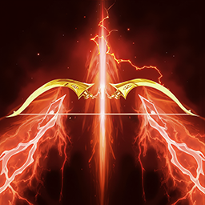
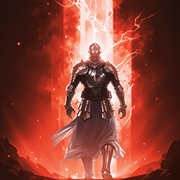
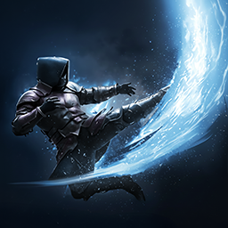

# Leveling

## Intro

Dans cette partie, nous allons voir comment gérer globalement la phase de **leveling du niveau 1 au niveau 45**. Je ne détaillerai pas chaque palier de niveau.

Le principe du leveling est simple : suivre les **quêtes principales (jaunes)**, puis faire les **quêtes secondaires (vertes)** que vous rencontrez en chemin.

Certaines quêtes vertes sont tout aussi importantes que les quêtes principales, car elles vous octroient :

- des points de Daevanion ;
- des runes PvE ;
- des équipements, notamment des accessoires en début de jeu, que vous n'obtenez que par celles-ci.

Gardez à l'esprit que certaines quêtes secondaires en débloquent d'autres, qui vous permettront d'obtenir de nouveaux accessoires plus puissants.

Pensez aussi à récupérer autant de **plumes** que possible en chemin. Évitez cependant de trop vous éloigner de votre itinéraire pour les quêtes principales et secondaires.

Pensez également à faire vos **donjons scellés** et vos **Stronghold**.

!!! note
    Une fois votre monolithe au **niveau 30**, ne vous attardez pas trop sur les plumes restantes : ce n'est pas indispensable.

??? tip "Optimisation du leveling"
    Si vous souhaitez optimiser ou accélérer un peu votre leveling, je vous conseille de configurer une **macro d'interaction**.

    Dans les options du jeu, assignez **deux touches d'interaction**. La touche `F` est assignée par défaut ; ajoutez-en une seconde, éventuellement une touche inutilisée.

    Si votre souris Logitech ou une souris d'une autre marque permet de créer des macros, configurez-en une dans le logiciel correspondant avec :

    - les deux touches d'interaction ;
    - le clic gauche de la souris.

    Cela réduit considérablement le temps total passé dans les dialogues avec les PNJ.

## Skills

!!! note "Leveling des sorts"
    Cette section concerne uniquement la progression de vos compétences pendant le leveling, du **niveau 1 au niveau 45**.
    Je vous conseille également d'acheter des **Wisdom Stones** (points de compétence) dès que possible afin d'améliorer vos sorts au maximum avec ces points. Le niveau maximal atteignable avec les points de compétence est le niveau 10.

!!! tip "Niveau des sorts actifs"
    Comme indiqué plus haut, les points de compétence permettent de monter un sort actif jusqu'au **niveau 10**.
    Les Daevanions apportent **4 niveaux** supplémentaires à vos sorts actifs.
    Vous pouvez en obtenir **2 de plus** grâce aux soulbinds/traits des anneaux. Les anneaux et les armes sont les seuls équipements qui vous permettent de choisir les sorts actifs concernés.
    Ces bonus permettent déjà d'atteindre le **niveau 16** sur certains sorts actifs, un palier minimal à viser pour vos compétences importantes.
    Les **Arcanas** vous permettent ensuite de compléter la progression jusqu'au **niveau 20**.

### Priorité générale

Pendant le leveling, évitez de répartir vos points uniformément entre toutes
vos compétences.

L'objectif est de monter en priorité les compétences qui apportent le plus
à votre progression, puis d'investir progressivement dans le reste de votre kit.

### Compétences actives

Pendant le leveling, inutile de chercher à monter toutes vos compétences
actives de manière uniforme. Certains paliers sont plus intéressants à
atteindre rapidement afin de débloquer les spécialités utiles à votre progression.

Voici les principaux objectifs à viser :

| Compétence | Niveau conseillé |
|---|:---:|
|  **Snipe** | **8-12-+** |
|  **Tempest Shot** | **8-12-+** |
|  **Snare Shot** | **8-12-+** |
|  **Marking Shot** | **8–12** |
|  **Drill Dart** | **8-12-+** |
|  **Gale Arrow** | **8-12-+** |
|  **Burst Arrow** | **8-12-+** |
|  **Deadshot** | **8-12-+** |

!!! tip "Marking Shot"
    **Marking Shot** peut dans un premier temps être conservé au **niveau 8**.
    Vous pourrez ensuite le monter au **niveau 12** lorsque vous disposerez
    de suffisamment de points.

!!! note
    Ces niveaux représentent des **objectifs pendant le leveling** et non
    le niveau définitif conseillé pour ces compétences une fois niveau maximum.  

    Pour les spécialités, consultez la section dédiée aux compétences et spécialités, détaillée par niveau de compétence **[ici](../skills/index.md#actifs-specialites)**.

### Compétences passives

Pour les compétences passives, la priorité reste globalement la même pendant
toute la progression.

Plutôt que de dupliquer les explications ici, vous pouvez retrouver les
différents passifs ainsi que leur ordre de priorité dans la section dédiée :

→ **[Priorité des compétences passives](../skills/index.md#passifs)**

### Stigmas

!!! note 
    Au fil du leveling, vous débloquerez des slots de Stigma. Voici ceux à privilégier.

Au début de la version Global, nous disposerons de **4 slots de Stigma** au maximum. Voici ceux à privilégier, dans l'ordre :

| Compétence | Info comp. |
|---|:---:|
|  **Vaizel's Authority** | **Buff** qui augmente votre **attaque de 20 %**, votre **Perfect Chance de 10 %**, l'efficacité de **Focused Eye** et **Hunter's Soul de 1,5**, et vous donne **50 %** de chances de **réduire tous vos cooldowns de 1 s** lors d'un coup critique. |
|  **Bow of Blessing** | **Buff** qui augmente votre **taux de critique de 200** et votre **précision de 100**, ajoute **50 % de Multi-Hit**, augmente votre **attaque** en fonction de votre **taux de critique** et de vos **dégâts critiques**, et ajoute **7 %** de chances de **Double Hit**. |
|  **Supporting Fire** | **Sort DPS passif** qui invoque une **orbe** ayant **25 %** de chances (jusqu'à **50 %**) d'infliger des dégâts à votre cible. |

Vous devriez pouvoir monter chacun d'eux au moins au **niveau 5** afin de débloquer sa première spécialité avant de passer au suivant.

Vous pouvez choisir le quatrième Stigma selon vos préférences et la situation. Vous pouvez réinitialiser les niveaux de Stigma à tout moment :

| Compétence | Info comp. |
|---|:---:|
|  **Griffon Arrow** | **Choix offensif/DPS**, qui inflige également des dégâts sur la durée (DoT). |
|  **Arrow Storm** | **DPS**, particulièrement intéressant avec **Slow** ; il peut se révéler plus efficace qu'**Explosive Arrow**. |
|  **Explosive Arrow** | **DPS**, particulièrement intéressant avec **Slow/Root**. |
|  **Ambush Kick** | **Mobilité, survie et repositionnement.** |
|  **Mother Nature's Breath** | **Défense et survie.** |

!!! tip "Monter de niveau des stigmas"
    Une fois chaque Stigma monté au **niveau 5**, vous pouvez les monter au **niveau 10**, l'un après l'autre. Je vous conseille ensuite de viser **Vaizel's Authority au niveau 20** : sa spécialité de niveau 20 donne **50 %** de chances de réduire tous vos cooldowns de **1 seconde** lors d'un coup critique.

!!! tip "Monter un stigma level 20"
    Sur **Taiwan** comme sur **Global**, il faut compter **75 Stigma Shards** pour monter un Stigma au **niveau 20**.
    *À Taïwan, un Stigma Shard coûte ___25 000 points d'Abyss___, soit ___1 875 000 points d'Abyss___ pour les ___75 Stigma Shards___. Sur la version Global, leur prix dans l'Abyss Shop pourrait être ___plus bas___ (autour de ___10K___). Cette donnée n'est pas encore confirmée et sera mise à jour dès que possible.*

    D'autres moyens d'obtenir des Stigma Shards pourraient être disponibles, notamment le système de morph à partir de fragments de Stigma Shard.

### Objectif : niveau 45

Une fois au niveau 45, l'objectif est d'amener progressivement vos principales
compétences actives au **niveau 16** afin de débloquer leur dernier palier
de spécialité.

Pour l'optimisation complète des compétences après le leveling :

→ [Voir la section des compétences](../skills/index.md)
