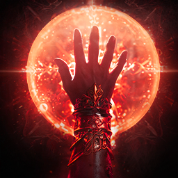
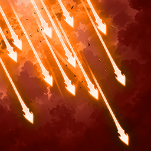
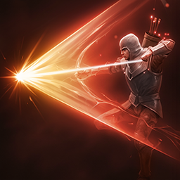
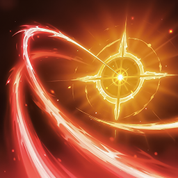
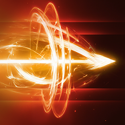
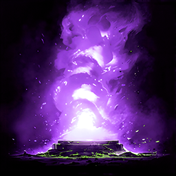
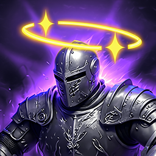

# Skills

## Intro

**This section covers the available specializations and how they fit different playstyles.**

Personally, I think it's a good idea to get almost all **active skills to level 16**.

This unlocks the final specialization tier and gives you access to stronger combinations.

!!! info "Arcanas"
    Arcanas offer plenty of room to vary your setup or go *all-in* on certain skills, depending on your playstyle.

## Passives { #passives }
*Screenshot of my character in Taiwan.*  

There are **two main passive skills** to focus on, so try to raise them as much as possible. **Level 30 or higher** is a good long-term target:

| Skill | Details |
|---|:---:|
|  **Focused Eye** | Boosts your PvE and PvP damage, as well as your chance to **Double Hit**. |
|  **Hunter's Resolve** | Boosts the damage of your critical hits. |

After those, consider:

| Skill | Details |
|---|:---:|
|  **Hunter's Soul** | **50%** chance to deal additional damage on a critical hit. |
|  **Concentrated Fire** | Also useful for dealing extra damage (**50%** chance) to targets affected by your **DoTs**. |
|  **Vigilant Eye** | Useful for increasing your **HP percentage**. |

After that, **Melee Fire** and **Rooting Eye** can be nice bonuses, but I don't prioritize them over the first three or four passives listed above.

## Active Skills & Specializations { #active-skills-specializations }
*Screenshot of my character in Taiwan.*  

This is probably the most useful section of the guide for optimizing skills and their specializations at different skill levels.
The levels shown in the tables below are the recommended targets for each skill.

For skills with the **Changes to mobile skill** specialization, the choice comes down to your playstyle and whether you want to keep dealing damage while moving instead of stopping to cast.

*The number at the beginning of each line indicates which specialization to activate.*

??? tip "Snipe"
    *A useful skill, mainly for reducing ___Deadshot___'s cooldown even further.*
    

    <table>
      <thead>
        <tr>
          <th>Skill</th>
          <th>Level</th>
          <th>Specialization</th>
        </tr>
      </thead>
      <tbody>
        <tr>
          <td rowspan="4">
             <strong>Snipe</strong>
          </td>
          <td>8</td>
          <td>
**3.** +50% Multi-Hit
</td>
        </tr>
        <tr>
          <td>12</td>
          <td>
            

                **3.** +50% Multi-hit 
                **4.** -1s Deadshot cooldown
            

          </td>
        </tr>
        <tr>
          <td>16</td>
          <td>
            

              **3.** +50% Multi-hit 
              **4.** -1s Deadshot cooldown 
              OU
              **4.** -1s Deadshot cooldown 
              **5.** Adds [Tempest Arrow] Chain skill
            

          </td>
        </tr>
        <tr>
          <td>20 *(si possible)*</td>
          <td>
            

                **3.** +50% Multi-hit 
                **4.** -1s Deadshot cooldown 
                **5.** Adds [Tempest Arrow] Chain Skill
            

          </td>
        </tr>
      </tbody>
    </table>
    

??? tip "Tempest shot"
    

    <table>
      <thead>
        <tr>
          <th>Skill</th>
          <th>Level</th>
          <th>Specialization</th>
        </tr>
      </thead>
      <tbody>
        <tr>
          <td rowspan="3">
             <strong>Tempest Shot</strong>
          </td>
          <td>8</td>
          <td>
**3.** Deals up to 12% more damage when less targets hit
</td>
        </tr>
        <tr>
          <td>12</td>
          <td>
            

                **2.** +10% skill Critical Hit 
                **3.** Deals up to 12% more damage when less targets hit
            

          </td>
        </tr>
        <tr>
          <td>16</td>
          <td>
            

              **3.** Deals up to 12% more damage when less targets hit 
              **5.** +20% Skill Speed 
            

          </td>
        </tr>
      </tbody>
    </table>
    

??? tip "Snare shot"
    *Applies **Slow** to your targets, allowing you to use ___Burst Arrow___.*
    

    <table>
      <thead>
        <tr>
          <th>Skill</th>
          <th>Level</th>
          <th>Specialization</th>
        </tr>
      </thead>
      <tbody>
        <tr>
          <td rowspan="2">
             <strong>Snare Shot</strong>
          </td>
          <td>8</td>
          <td>
            

                **2.** +20% Skill Speed
                
OU

                **3.** Changes to mobile skill
            

          </td>
        </tr>
        <tr>
          <td>12</td>
          <td>
            

                **2.** +20 Skill Speed 
                **3.** Changes to mobile skill
                
OU

                **2.** +20% Skill Speed 
                **4.** Adds [Shackling Arrow] Chain Skill
            

          </td>
        </tr>
      </tbody>
    </table>
    

??? tip "Marking Shot"
    *A support skill that grants the ___Precision___ buff. It increases your Critical Hit by 300 and, with the first specialization, increases your Perfect Chance by 5%.*
    

    <table>
      <thead>
        <tr>
          <th>Skill</th>
          <th>Level</th>
          <th>Specialization</th>
        </tr>
      </thead>
      <tbody>
        <tr>
          <td rowspan="2">
             <strong>Marking Shot</strong>
          </td>
          <td>8</td>
          <td>
**1.** +5% Perfect Chance for the duration
</td>
        </tr>
        <tr>
          <td>12</td>
          <td>
            

                **1.** +5% Perfect Chance for the duration 
                **3.** +5s duration
            

          </td>
        </tr>
      </tbody>
    </table>
    

??? tip "Drill dart"
    *One of the first important Ranger skills to raise to level 20.*
    

    <table>
      <thead>
        <tr>
          <th>Skill</th>
          <th>Level</th>
          <th>Specialization</th>
        </tr>
      </thead>
      <tbody>
        <tr>
          <td rowspan="4">
             <strong>Drill Dart</strong>
          </td>
          <td>8</td>
          <td>
**3.** +20% Skill Speed
</td>
        </tr>
        <tr>
          <td>12</td>
          <td>
            

                **3.** +20% Skill Speed 
                **4.** Multi-Hit on hit
            

          </td>
        </tr>
        <tr>
          <td>16</td>
          <td>
            

              **4.** Multi-Hit on hit 
              **5.** Activates [Drill Dart] 1 extra time 
            

          </td>
        </tr>
        <tr>
          <td>20 *(si possible)*</td>
          <td>
            

                **3.** +20% Skill Speed 
                **4.** Multi-Hit on hit 
                **5.** Activates [Drill Dart] 1 extra time
            

          </td>
        </tr>
      </tbody>
    </table>
    

??? tip "Arrow Scattershot"
    *A situational skill used mainly during boss Stagger phases. It's rarely recommended in the late game, but I like its level 16 specialization combo with ___Vaizel's Authority___. Don't prioritize raising it to level 16.*
    

    <table>
      <thead>
        <tr>
          <th>Skill</th>
          <th>Level</th>
          <th>Specialization</th>
        </tr>
      </thead>
      <tbody>
        <tr>
          <td rowspan="3">
             <strong>Arrow Scattershot</strong>
          </td>
          <td>8</td>
          <td>
**1.** Absorbs % HP 
OU
**3.** Changes to mobile skill
</td>
        </tr>
        <tr>
          <td>12</td>
          <td>
            

                **1.** Absorbs % HP 
                **4.** Multi-Hit on hit
            

          </td>
        </tr>
        <tr>
          <td>16</td>
          <td>
            

              **1.** Absorbs % HP 
              **5.** -1s all cooldowns on hit 
              OU
              **4.** Multi-Hit on hit 
              **5.** -1s all cooldowns on hit
            

          </td>
        </tr>
      </tbody>
    </table>
    

??? tip "Gale Arrow"
    *Another important skill to raise to level 20.*
    

    <table>
      <thead>
        <tr>
          <th>Skill</th>
          <th>Level</th>
          <th>Specialization</th>
        </tr>
      </thead>
      <tbody>
        <tr>
          <td rowspan="4">
             <strong>Gale Arrow</strong>
          </td>
          <td>8</td>
          <td>
**3.** Changes to mobile skill
</td>
        </tr>
        <tr>
          <td>12</td>
          <td>
            

                **3.** Changes to mobile skill 
                **4.** Increases Combat Speed, PvE Damage Boost by 9%-15%, and PvP Damage Boost by 4.5%-7.5%, with the bonuses scaling inversely with the number of targets hit.
            

          </td>
        </tr>
        <tr>
          <td>16</td>
          <td>
            

                **3.** Changes to mobile skill 
                **4.** Increases Combat Speed, PvE Damage Boost by 9%-15%, and PvP Damage Boost by 4.5%-7.5%, with the bonuses scaling inversely with the number of targets hit.
              OU
                **4.** Increases Combat Speed, PvE Damage Boost by 9%-15%, and PvP Damage Boost by 4.5%-7.5%, with the bonuses scaling inversely with the number of targets hit. 
                **5.** -10s cooldown
            

          </td>
        </tr>
        <tr>
          <td>20</td>
          <td>
            

                **3.** Changes to mobile skill 
                **4.** Increases Combat Speed, PvE Damage Boost by 9%-15%, and PvP Damage Boost by 4.5%-7.5%, with the bonuses scaling inversely with the number of targets hit. 
                **5.** -10s cooldown
            

          </td>
        </tr>
      </tbody>
    </table>
    

??? tip "Explosion Trap"
    *A rarely used skill, mainly reserved for trash mob clearing phases such as Transcendence. It can also help group the enemies it hits.*
    

    <table>
      <thead>
        <tr>
          <th>Skill</th>
          <th>Level</th>
          <th>Specialization</th>
        </tr>
      </thead>
      <tbody>
        <tr>
          <td rowspan="2">
             <strong>Explosion Trap</strong>
          </td>
          <td>8</td>
          <td>
**1.** Pulls enemies on explosion
</td>
        </tr>
        <tr>
          <td>12</td>
          <td>
            

                **1.** Pulls enemis on explosion 
                **3.** Extra damage after 3s on hit
            

          </td>
        </tr>
      </tbody>
    </table>
    

??? tip "Burst Arrow"
    *Can only be used on targets affected by ___Slow___ or ___Root___ and isn't a priority to raise to level 20.*
    

    <table>
      <thead>
        <tr>
          <th>Skill</th>
          <th>Level</th>
          <th>Specialization</th>
        </tr>
      </thead>
      <tbody>
        <tr>
          <td rowspan="4">
             <strong>Burst Arrow</strong>
          </td>
          <td>8</td>
          <td>
            

                **2.** +50% Multi-hit on hit
                
OU

                **3.** Changes to mobile skill
            

          </td>
        </tr>
        <tr>
          <td>12</td>
          <td>
            

                **3.** Changes to mobile skill 
                **4.** Up to +20% damage when less targets hit
            

          </td>
        </tr>
        <tr>
          <td>16</td>
          <td>
            

              **4.** Up to +20% damage when less targets hit 
              **5.** 25% chance to reset cooldown hit
              OU
              **3.** Changes to mobile skill 
              **5.** 25% chance to reset cooldown on hit
            

          </td>
        </tr>
        <tr>
          <td>20</td>
          <td>
            

                **3.** Changes to mobile skill 
                **4.** Up to +20% damage when less targets hit 
                **5.** 25% chance to reset cooldown on hit
            

          </td>
        </tr>
      </tbody>
    </table>
    

??? tip "Suppressing Arrow"
    *Rarely used for DPS; its main value is its stun, and it can only be used while the ___Precision___ buff is active.*
    

    <table>
      <thead>
        <tr>
          <th>Skill</th>
          <th>Level</th>
          <th>Specialization</th>
        </tr>
      </thead>
      <tbody>
        <tr>
          <td rowspan="2">
             <strong>Suppressing Arrow</strong>
          </td>
          <td>8</td>
          <td>
**1.** +50% Multi-Hit on hit
</td>
        </tr>
        <tr>
          <td>12</td>
          <td>
            

                **1.** +50% Multi-hit 
                **3.** +20% Skill Speed
            

          </td>
        </tr>
      </tbody>
    </table>
    

??? tip "Deadshot"
    *The Ranger's most important skill. It has three charge levels and deals more single-target damage than your other skills. Charge it fully and try to have the ___Precision___ buff active; the final specialization adds extra damage. It consistently ranks near the top of your DPS breakdown.*
    

    <table>
      <thead>
        <tr>
          <th>Skill</th>
          <th>Level</th>
          <th>Specialization</th>
        </tr>
      </thead>
      <tbody>
        <tr>
          <td rowspan="4">
             <strong>Deadshot</strong>
          </td>
          <td>8</td>
          <td>
**2.** +30% Skill Speed
OU
**3.** Changes to mobile skill
</td>
        </tr>
        <tr>
          <td>12</td>
          <td>
            

                **2.** +30% Skill Speed 
                **3.** Changes to mobile skill
                
OU

                **2.** +30% Skill Speed 
                **4.** Ignores Block and Evasion and lands as Multi-hit
            

          </td>
        </tr>
        <tr>
          <td>16</td>
          <td>
            

              **2.** +30% Skill Speed 
              **5.** [Deadshot] grants extra damage on hit
            

          </td>
        </tr>
        <tr>
          <td>20</td>
          <td>
            

                **2.** +30% Skill Speed 
                **4.** Ignores Block and Evasion and lands as Multi-Hit 
                **5.** [Deadshot] grants extra damage on hit.
            

          </td>
        </tr>
      </tbody>
    </table>
    

??? tip "Defiance"
    *A defensive skill that cleanses effects such as ___Stun___, ___Knockdown___, ___Airborne___, ___Grab___, ___Frost___, and ___Fear___.*
    

    <table>
      <thead>
        <tr>
          <th>Skill</th>
          <th>Level</th>
          <th>Specialization</th>
        </tr>
      </thead>
      <tbody>
        <tr>
          <td rowspan="3">
             <strong>Defiance</strong>
          </td>
          <td>8</td>
          <td>
**3.** Restores 20% HP on using [Defiance]
</td>
        </tr>
        <tr>
          <td>12</td>
          <td>
            

                **2.** Restores 1000 Stamina on using [Defiance] 
                **3.** Restores 20% HP on using [Defiance]
            

          </td>
        </tr>
        <tr>
          <td>16</td>
          <td>
            

              **3.** Restores 20% HP on using [Defiance] 
              **5.** +50% PvE Damage Tolerance and +25% PvP Damage Tolerance
            

          </td>
        </tr>
      </tbody>
    </table>
    

## Stigmas

This section is also covered in the leveling guide.

→ **[Stigma priorities](../leveling/index.md#stigmas)**
