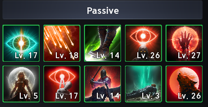
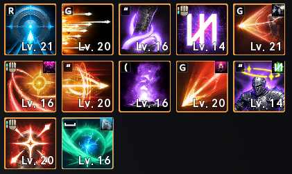
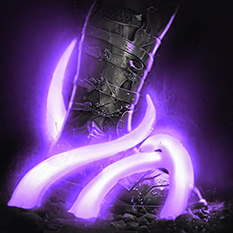
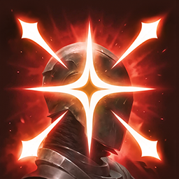

# Skills

## Intro

**Cette section présente les différentes spécialisations possibles selon votre style de jeu.**

Personnellement, je trouve intéressant d'avoir presque toutes les **compétences actives au niveau 16**.

Cela permet de débloquer le dernier palier de spécialité et d'accéder à de meilleures combinaisons.

!!! info "Arcanas"
    Les Arcanas offrent de nombreuses possibilités de variation et permettent de concentrer vos ressources sur certaines compétences selon votre style de jeu.

## Passifs { #passifs }
*Capture d'écran de mon personnage à Taïwan.*

Parmi les compétences passives, il y en a principalement **deux à privilégier**. Essayez de les monter aussi haut que possible ; **le niveau 30 ou plus** serait un bon objectif à terme :

| Compétence | Info comp. |
|---|:---:|
|  **Focused Eye** | Augmente vos dégâts en PvE et en PvP, ainsi que vos chances de **Double Hit**. |
|  **Hunter's Resolve** | Augmente les dégâts de vos coups critiques. |

Vous pouvez ensuite investir dans :

| Compétence | Info comp. |
|---|:---:|
|  **Hunter's Soul** | **50 %** de chances d'infliger des dégâts supplémentaires lors d'un coup critique. |
|  **Concentrated Fire** | Peut également infliger des dégâts supplémentaires (**50 %** de chances) aux cibles affectées par vos **DoT**. |
|  **Vigilant Eye** | Utile pour augmenter vos **HP en %**. |

Ensuite, **Melee Fire** et **Rooting Eye** peuvent apporter un bonus intéressant, mais je ne les privilégie pas personnellement par rapport aux trois ou quatre passifs cités plus haut.

## Actifs & Spécialités { #actifs-specialites }
*Capture d'écran de mon personnage à Taïwan.*

Cette section est probablement la plus utile pour optimiser vos compétences et leurs spécialités en fonction de leur niveau.
Les niveaux indiqués dans les tableaux ci-dessous correspondent aux paliers recommandés pour chaque compétence.

Pour les compétences proposant la spécialité **Changes to mobile skill**, le choix dépend de votre style de jeu et de votre besoin d'infliger des dégâts tout en vous déplaçant, sans vous arrêter pour lancer la compétence.

*Le numéro au début de chaque ligne indique la spécialité à activer.*

??? tip "Snipe"
    *Compétence utile, principalement pour réduire davantage le cooldown de ___Deadshot___.*
    

    <table>
      <thead>
        <tr>
          <th>Compétence</th>
          <th>Niveau</th>
          <th>Spécialité</th>
        </tr>
      </thead>
      <tbody>
        <tr>
          <td rowspan="4">
             <strong>Snipe</strong>
          </td>
          <td>8</td>
          <td>
**3.** +50% Multi-Hit
</td>
        </tr>
        <tr>
          <td>12</td>
          <td>
            

                **3.** +50% Multi-hit 
                **4.** -1s Deadshot cooldown
            

          </td>
        </tr>
        <tr>
          <td>16</td>
          <td>
            

              **3.** +50% Multi-hit 
              **4.** -1s Deadshot cooldown 
              OU
              **4.** -1s Deadshot cooldown 
              **5.** Adds [Tempest Arrow] Chain skill
            

          </td>
        </tr>
        <tr>
          <td>20 *(si possible)*</td>
          <td>
            

                **3.** +50% Multi-hit 
                **4.** -1s Deadshot cooldown 
                **5.** Adds [Tempest Arrow] Chain Skill
            

          </td>
        </tr>
      </tbody>
    </table>
    

??? tip "Tempest shot"
    

    <table>
      <thead>
        <tr>
          <th>Compétence</th>
          <th>Niveau</th>
          <th>Spécialité</th>
        </tr>
      </thead>
      <tbody>
        <tr>
          <td rowspan="3">
             <strong>Tempest shot</strong>
          </td>
          <td>8</td>
          <td>
**3.** Deals up to 12% more damage when less targets hit
</td>
        </tr>
        <tr>
          <td>12</td>
          <td>
            

                **2.** +10% skill Critical Hit 
                **3.** Deals up to 12% more damage when less targets hit
            

          </td>
        </tr>
        <tr>
          <td>16</td>
          <td>
            

              **3.** Deals up to 12% more damage when less targets hit 
              **5.** +20% Skill Speed 
            

          </td>
        </tr>
      </tbody>
    </table>
    

??? tip "Snare shot"
    *Compétence qui applique **Slow** à vos cibles et vous permet d'utiliser ___Burst Arrow___.*
    

    <table>
      <thead>
        <tr>
          <th>Compétence</th>
          <th>Niveau</th>
          <th>Spécialité</th>
        </tr>
      </thead>
      <tbody>
        <tr>
          <td rowspan="2">
             <strong>Snare shot</strong>
          </td>
          <td>8</td>
          <td>
            

                **2.** +20% Skill Speed
                
OU

                **3.** Changes to mobile skill
            

          </td>
        </tr>
        <tr>
          <td>12</td>
          <td>
            

                **2.** +20 Skill Speed 
                **3.** Changes to mobile skill
                
OU

                **2.** +20% Skill Speed 
                **4.** Adds [Shackling Arrow] Chain Skill
            

          </td>
        </tr>
      </tbody>
    </table>
    

??? tip "Marking Shot"
    *Compétence de support qui vous confère le buff ___Precision___. Celui-ci augmente votre Critical Hit de 300 ; avec la première spécialité, il augmente aussi votre Perfect Chance de 5 %.*
    

    <table>
      <thead>
        <tr>
          <th>Compétence</th>
          <th>Niveau</th>
          <th>Spécialité</th>
        </tr>
      </thead>
      <tbody>
        <tr>
          <td rowspan="2">
             <strong>Marking shot</strong>
          </td>
          <td>8</td>
          <td>
**1.** +5% Perfect Chance for the duration
</td>
        </tr>
        <tr>
          <td>12</td>
          <td>
            

                **1.** +5% Perfect Chance for the duration 
                **3.** +5s duration
            

          </td>
        </tr>
      </tbody>
    </table>
    

??? tip "Drill dart"
    *L'une des premières compétences importantes du Ranger à monter au niveau 20.*
    

    <table>
      <thead>
        <tr>
          <th>Compétence</th>
          <th>Niveau</th>
          <th>Spécialité</th>
        </tr>
      </thead>
      <tbody>
        <tr>
          <td rowspan="4">
             <strong>Drill dart</strong>
          </td>
          <td>8</td>
          <td>
**3.** +20% Skill Speed
</td>
        </tr>
        <tr>
          <td>12</td>
          <td>
            

                **3.** +20% Skill Speed 
                **4.** Multi-Hit on hit
            

          </td>
        </tr>
        <tr>
          <td>16</td>
          <td>
            

              **4.** Multi-Hit on hit 
              **5.** Activates [Drill Dart] 1 extra time 
            

          </td>
        </tr>
        <tr>
          <td>20 *(si possible)*</td>
          <td>
            

                **3.** +20% Skill Speed 
                **4.** Multi-Hit on hit 
                **5.** Activates [Drill Dart] 1 extra time
            

          </td>
        </tr>
      </tbody>
    </table>
    

??? tip "Arrow Scattershot"
    *Compétence situationnelle, surtout utilisée pendant les phases de Stagger des boss. Elle est peu recommandée en endgame, mais j'apprécie la combinaison de ses spécialités au niveau 16 avec ___Vaizel's Authority___. Ne cherchez donc pas à la monter au niveau 16 en priorité.*
    

    <table>
      <thead>
        <tr>
          <th>Compétence</th>
          <th>Niveau</th>
          <th>Spécialité</th>
        </tr>
      </thead>
      <tbody>
        <tr>
          <td rowspan="3">
             <strong>Arrow scattershot</strong>
          </td>
          <td>8</td>
          <td>
**1.** Absorbs % HP 
OU
**3.** Changes to mobile skill
</td>
        </tr>
        <tr>
          <td>12</td>
          <td>
            

                **1.** Absorbs % HP 
                **4.** Multi-Hit on hit
            

          </td>
        </tr>
        <tr>
          <td>16</td>
          <td>
            

              **1.** Absorbs % HP 
              **5.** -1s all cooldowns on hit 
              OU
              **4.** Multi-Hit on hit 
              **5.** -1s all cooldowns on hit
            

          </td>
        </tr>
      </tbody>
    </table>
    

??? tip "Gale Arrow"
    *Une autre compétence importante à monter au niveau 20.*
    

    <table>
      <thead>
        <tr>
          <th>Compétence</th>
          <th>Niveau</th>
          <th>Spécialité</th>
        </tr>
      </thead>
      <tbody>
        <tr>
          <td rowspan="4">
             <strong>Gale Arrow</strong>
          </td>
          <td>8</td>
          <td>
**3.** Changes to mobile skill
</td>
        </tr>
        <tr>
          <td>12</td>
          <td>
            

                **3.** Changes to mobile skill 
                **4.** Increases Combat Speed, PvE Damage Boost by 9%-15% and PvP Damage Boost by 4.5%-7.5% en fonction inverse du nombre de cibles touchées.
            

          </td>
        </tr>
        <tr>
          <td>16</td>
          <td>
            

                **3.** Changes to mobile skill 
                **4.** Increases Combat Speed, PvE Damage Boost by 9%-15% and PvP Damage Boost by 4.5%-7.5% en fonction inverse du nombre de cibles touchées.
              OU
                **4.** Increases Combat Speed, PvE Damage Boost by 9%-15% and PvP Damage Boost by 4.5%-7.5% en fonction inverse du nombre de cibles touchées. 
                **5.** -10s cooldown
            

          </td>
        </tr>
        <tr>
          <td>20</td>
          <td>
            

                **3.** Changes to mobile skill 
                **4.** Increases Combat Speed, PvE Damage Boost by 9%-15% and PvP Damage Boost by 4.5%-7.5% en fonction inverse du nombre de cibles touchées. 
                **5.** -10s cooldown
            

          </td>
        </tr>
      </tbody>
    </table>
    

??? tip "Explosion Trap"
    *Compétence très peu utilisée, surtout lors des phases de nettoyage de trash mobs, par exemple en Transcendence. Elle peut alors aider à regrouper les ennemis touchés.*
    

    <table>
      <thead>
        <tr>
          <th>Compétence</th>
          <th>Niveau</th>
          <th>Spécialité</th>
        </tr>
      </thead>
      <tbody>
        <tr>
          <td rowspan="2">
             <strong>Explosion Trap</strong>
          </td>
          <td>8</td>
          <td>
**1.** Pulls enemies on explosion
</td>
        </tr>
        <tr>
          <td>12</td>
          <td>
            

                **1.** Pulls enemis on explosion 
                **3.** Extra damage after 3s on hit
            

          </td>
        </tr>
      </tbody>
    </table>
    

??? tip "Burst Arrow"
    *Compétence utilisable uniquement sur les cibles affectées par ___Slow___ ou ___Root___. Elle n'est pas prioritaire à monter au niveau 20.*
    

    <table>
      <thead>
        <tr>
          <th>Compétence</th>
          <th>Niveau</th>
          <th>Spécialité</th>
        </tr>
      </thead>
      <tbody>
        <tr>
          <td rowspan="4">
             <strong>Burst Arrow</strong>
          </td>
          <td>8</td>
          <td>
            

                **2.** +50% Multi-hit on hit
                
OU

                **3.** Changes to mobile skill
            

          </td>
        </tr>
        <tr>
          <td>12</td>
          <td>
            

                **3.** Changes to mobile skill 
                **4.** Up to +20% damage when less targets hit
            

          </td>
        </tr>
        <tr>
          <td>16</td>
          <td>
            

              **4.** Up to +20% damage when less targets hit 
              **5.** 25% chance to reset cooldown hit
              OU
              **3.** Changes to mobile skill 
              **5.** 25% chance to reset cooldown on hit
            

          </td>
        </tr>
        <tr>
          <td>20</td>
          <td>
            

                **3.** Changes to mobile skill 
                **4.** Up to +20% damage when less targets hit 
                **5.** 25% chance to reset cooldown on hit
            

          </td>
        </tr>
      </tbody>
    </table>
    

??? tip "Suppressing Arrow"
    *Compétence peu utilisée pour le DPS, surtout utile pour son effet de stun. Elle n'est utilisable que lorsque le buff ___Precision___ est actif.*
    

    <table>
      <thead>
        <tr>
          <th>Compétence</th>
          <th>Niveau</th>
          <th>Spécialité</th>
        </tr>
      </thead>
      <tbody>
        <tr>
          <td rowspan="2">
             <strong>Suppressing Arrow</strong>
          </td>
          <td>8</td>
          <td>
**1.** +50% Multi-Hit on hit
</td>
        </tr>
        <tr>
          <td>12</td>
          <td>
            

                **1.** +50% Multi-hit 
                **3.** +20% Skill Speed
            

          </td>
        </tr>
      </tbody>
    </table>
    

??? tip "Deadshot"
    *La compétence la plus importante du Ranger. Elle possède trois niveaux de charge et inflige plus de dégâts que vos autres compétences à une cible. Chargez-la au maximum et essayez d'avoir le buff ___Precision___ actif : la dernière spécialité lui ajoute des dégâts. Elle figure régulièrement en tête du détail de votre DPS.*
    

    <table>
      <thead>
        <tr>
          <th>Compétence</th>
          <th>Niveau</th>
          <th>Spécialité</th>
        </tr>
      </thead>
      <tbody>
        <tr>
          <td rowspan="4">
             <strong>Deadshot</strong>
          </td>
          <td>8</td>
          <td>
**2.** +30% Skill Speed
OU
**3.** Changes to mobile skill
</td>
        </tr>
        <tr>
          <td>12</td>
          <td>
            

                **2.** +30% Skill Speed 
                **3.** Changes to mobile skill
                
OU

                **2.** +30% Skill Speed 
                **4.** Ignores Block and Evasion and lands as Multi-hit
            

          </td>
        </tr>
        <tr>
          <td>16</td>
          <td>
            

              **2.** +30% Skill Speed 
              **5.** [Deadshot] grants extra damage on hit
            

          </td>
        </tr>
        <tr>
          <td>20</td>
          <td>
            

                **2.** +30% Skill Speed 
                **4.** Ignores Block and Evasion and lands as Multi-Hit 
                **5.** [Deadshot] grants extra damage on hit.
            

          </td>
        </tr>
      </tbody>
    </table>
    

??? tip "Defiance"
    *Compétence défensive qui vous permet de dissiper des effets comme ___Stun___, ___Knockdown___, ___Airborne___, ___Grab___, ___Frost___ ou ___Fear___.*
    

    <table>
      <thead>
        <tr>
          <th>Compétence</th>
          <th>Niveau</th>
          <th>Spécialité</th>
        </tr>
      </thead>
      <tbody>
        <tr>
          <td rowspan="3">
             <strong>Defiance</strong>
          </td>
          <td>8</td>
          <td>
**3.** Restores 20% HP on using [Defiance]
</td>
        </tr>
        <tr>
          <td>12</td>
          <td>
            

                **2.** Restores 1000 Stamina on using [Defiance] 
                **3.** Restores 20% HP on using [Defiance]
            

          </td>
        </tr>
        <tr>
          <td>16</td>
          <td>
            

              **3.** Restores 20% HP on using [Defiance] 
              **5.** +50% PvE Damage Tolerance and +25% PvP Damage Tolerance
            

          </td>
        </tr>
      </tbody>
    </table>
    

## Stigmas

Cette section a déjà été abordée dans le guide de leveling.

→ **[Priorité des stigmas](../leveling/index.md#stigmas)**
